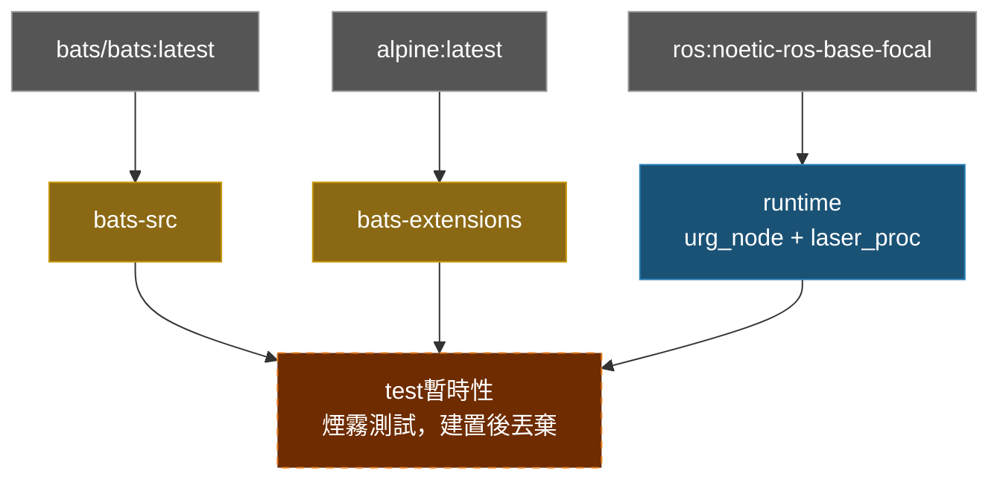

**[English](../README.md)** | **[繁體中文](README.zh-TW.md)** | **[简体中文](README.zh-CN.md)** | **[日本語](README.ja.md)**

# Hokuyo URG LiDAR Docker 容器（ROS 1 Noetic）

> **TL;DR** — 容器化的 Hokuyo URG LiDAR ROS 1 Noetic 驅動程式。透過 apt 安裝 `ros-noetic-urg-node` 和 `ros-noetic-laser-proc`，預設啟動 `urg_lidar.launch`。
>
> ```bash
> ./build.sh && ./run.sh
> ```

## 目錄

- [功能特色](#功能特色)
- [快速開始](#快速開始)
- [使用方式](#使用方式)
- [設定](#設定)
- [架構](#架構)
- [Smoke Tests](#smoke-tests)
- [目錄結構](#目錄結構)

---

## 功能特色

- **Apt 安裝**：從 ROS apt 套件庫安裝 `ros-noetic-urg-node` 和 `ros-noetic-laser-proc`
- **Smoke Test**：Bats 測試在建置時自動執行，驗證環境正確性
- **Docker Compose**：單一 `compose.yaml` 管理所有目標
- **Privileged 模式**：預先設定掛載 `/dev` 以存取感測器
- **多架構支援**：支援 x86_64 和 ARM64（RPi、Jetson CPU 模式）

## 快速開始

```bash
# 1. 建置
./build.sh

# 2. 執行（預設：roslaunch urg_node urg_lidar.launch）
./run.sh

# 或直接使用 docker compose
docker compose up runtime
docker compose down
```

## 使用方式

### 執行環境

```bash
./build.sh                       # 建置（預設：runtime）
./build.sh --no-env test         # 建置但不更新 .env
./run.sh                         # 啟動（預設：runtime）
./exec.sh                        # 進入執行中的容器
./stop.sh                        # 停止並移除容器

docker compose build runtime     # 等效指令
docker compose up runtime        # 啟動
docker compose exec runtime bash # 進入執行中的容器
```

### 測試（test）

Smoke tests 在建置時自動執行；測試失敗則建置失敗。

```bash
./build.sh test
# 或
docker compose --profile test build test
```

## 設定

### .env 參數

| 變數 | 說明 | 範例 |
|------|------|------|
| `DOCKER_HUB_USER` | Docker Hub 使用者名稱 | `myuser` |
| `IMAGE_NAME` | 映像檔名稱 | `urg_node_noetic` |

## 架構

### Docker 建置階段圖



### 階段說明

| 階段 | FROM | 用途 |
|------|------|------|
| `bats-src` | `bats/bats:latest` | Bats 執行檔來源，不出貨 |
| `bats-extensions` | `alpine:latest` | bats-support、bats-assert，不出貨 |
| `lint-tools` | `alpine:latest` | ShellCheck + Hadolint，不出貨 |
| `runtime` | `ros:noetic-ros-base-focal` | urg_node + laser_proc 套件 |
| `test` | `runtime` | Lint + smoke tests，建置後丟棄 |

## Smoke Tests

位於 `test/smoke_test/` — 在 `docker build --target test` 時自動執行 — 共 **22 項測試**。

<details>
<summary>點擊展開測試詳情</summary>

#### ROS 環境（3）

| 測試項目 | 說明 |
|----------|------|
| `ROS_DISTRO` | 已設定 |
| `setup.bash` | 檔案存在 |
| `setup.bash` | 可被 source |

#### urg_node 套件（2）

| 測試項目 | 說明 |
|----------|------|
| `urg_node` | 可透過 `rospack find` 查詢到 |
| `laser_proc` | 可透過 `rospack find` 查詢到 |

#### 系統（1）

| 測試項目 | 說明 |
|----------|------|
| `entrypoint.sh` | 存在且可執行 |

#### Script help（16）

| 測試項目 | 說明 |
|----------|------|
| `build.sh -h` | 結束碼 0 |
| `build.sh --help` | 結束碼 0 |
| `build.sh -h` | 顯示 usage |
| `run.sh -h` | 結束碼 0 |
| `run.sh --help` | 結束碼 0 |
| `run.sh -h` | 顯示 usage |
| `exec.sh -h` | 結束碼 0 |
| `exec.sh --help` | 結束碼 0 |
| `exec.sh -h` | 顯示 usage |
| `stop.sh -h` | 結束碼 0 |
| `stop.sh --help` | 結束碼 0 |
| `stop.sh -h` | 顯示 usage |
| `build.sh -h` | 從 `LANG=zh_TW.UTF-8` 偵測為 zh |
| `build.sh -h` | 從 `LANG=ja_JP.UTF-8` 偵測為 ja |
| `build.sh -h` | `LANG=en_US.UTF-8` 預設為 en |
| `build.sh -h` | `SETUP_LANG` 覆蓋 LANG |

</details>

## 目錄結構

```text
urg_node_noetic/
├── compose.yaml                 # Docker Compose 定義
├── Dockerfile                   # 多階段建置
├── build.sh                     # 建置腳本
├── run.sh                       # 執行腳本
├── exec.sh                      # 進入執行中的容器
├── stop.sh                      # 停止並移除容器
├── .env.example                 # 環境變數範本
├── .hadolint.yaml               # Hadolint 忽略規則
├── script/
│   └── entrypoint.sh            # 容器進入點
├── doc/
│   ├── README.zh-TW.md          # 繁體中文
│   ├── README.zh-CN.md          # 簡體中文
│   └── README.ja.md             # 日文
├── .github/workflows/           # CI/CD
│   ├── main.yaml                # 主要流程
│   ├── build-worker.yaml        # Docker 建置 + smoke test
│   └── release-worker.yaml      # GitHub Release
└── test/
    └── smoke_test/              # Bats 環境測試
        ├── ros_env.bats
        ├── script_help.bats
        └── test_helper.bash
```
